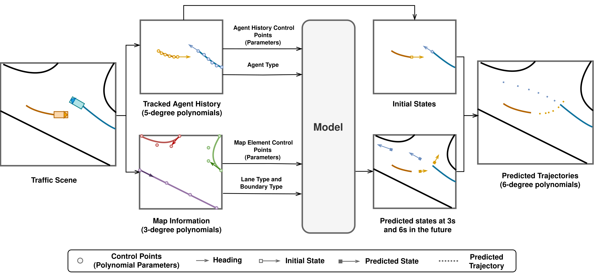

# Everything Polynomial: An Efficient and Robust Multi Modal Trajectory Predictor Baseline for Autonomous Driving
This repository contains the official implementation of "Improving Out-of-Distribution Generalization of Trajectory Prediction for Autonomous Driving via Polynomial Representations", forthcoming.



## Gettting Started

**Step 1**: Clone this repository and:
```
cd Everything-Polynomial/Argo2
```

**Step 2**: Create a conda environment and install the dependencies by running `setup.sh`:

**Step 3**: install the [Argoverse 2 API](https://github.com/argoverse/av2-api)(0.3.0) and download the [Argoverse 2 Motion Forecasting Dataset](https://www.argoverse.org/av2.html) following the [Argoverse 2 User Guide](https://argoverse.github.io/user-guide/getting_started.html). Rename the split to {split}_A2 (e.g. train to train_A2). The dataset directory should be organized as follows:
```
/data/datasets/
├── train_A2/
|   ├── aaaa-aaaa-aaaa/
|   ├── aaaa-aaaa-aaab/
|   ├── aaaa-aaaa-aaac/
└── val_A2/
|   ├── aaaa-aaaa-aaaa/
|   ├── aaaa-aaaa-aaab/
|   ├── aaaa-aaaa-aaac/
```

**Step 4 (optional)**: # Download Waymo Open Motion Dataset (we use the `scenario protocol` form dataset), rename with {split}_WO and organize the data as follows: 
```
/data/datasets/
├── train_WO/
|   ├── training.tfrecord-00000-of-01000/
|   ├── training.tfrecord-00001-of-01000/
|   ├── training.tfrecord-00002-of-01000/
└── val_WO/
|   ├── validation.tfrecord-00000-of-00150/
|   ├── validation.tfrecord-00001-of-00150/
|   ├── validation.tfrecord-00002-of-00150/
```
Install the [Waymo Open Dataset API](https://github.com/waymo-research/waymo-open-dataset/blob/master/docs/quick_start.md) as follows: 
```
pip install waymo-open-dataset-tf-2-6-0
```

## Preprocessing

Modify the split in `preprocess_argo2.py` run:
```
python preprocess_argo2.py
```

for Waymo:
```
python preprocess_waymo.py
```

**Note**: The preprocessing of complete Argoverse 2 takes almost two days on my machine. This is due to the tracking is done sequentially to each object. Additionally, fitting all the lane segments also takes considerable time.

We provide the preprocessed data for Argoverse 2 ([train](https://www.kaggle.com/datasets/yueyao1990/argoverse2-train-processed), [val, test](https://www.kaggle.com/datasets/yueyao1990/argoverse2-val-test-processed)) and Waymo with 5s history ([val](https://www.kaggle.com/datasets/yueyao1990/waymo-val-processed?rvi=1)). We have removed the scenario with id `598d73573ff233fa` from the WO validation due to the tracking issue with the target agent."


## Training

Modify the model_name in `train.py` to either "EP_F" or "EP_Q" and run:
```
python train.py
```

**Note**: Training EP_F takes ~6 hours on a single Tesla T4. Training EP_Q takes ~2.5 days on a single Tesla T4. 

During training, the checkpoints will be saved in `logs/weights/model_name/data` automatically. To monitor the training process:
```
tensorboard --logdir logs/weights/
```

## Evaluation

To evaluate the prediction performance, please run the notebook `evaluation and submission.ipynb`

## Pretrained Models

We provide the checkpoints of pretrained EP_F and EP-Q (with and without homogenizatioin) in [checkpoints/](Argo2/checkpoints). You can evaluate the pretrained models using the aforementioned evaluation script, or have a look at the training process via TensorBoard:
```
tensorboard --logdir checkpoints/
```

## Pretrained Models & Results

### In-Distribution Quantitative Results (6s Prediction Horizon)

| Model | Dataset | Split | Checkpoint | minADE (K=1) | minFDE (K=1) | minADE (K=6) | minFDE (K=6) |
| :--- | :---: | :---: | :---: | :---: | :---: | :---: | :---: |
| EP_F | A2 | Val | [EP_F](Argo2/checkpoints/EP_F_wo_homogenizing) | 1.88 | 4.55 | 0.79 | 1.53 |
| EP_F | A2 | Test | [EP_F](Argo2/checkpoints/EP_F_wo_homogenizing) | 1.89 | 4.57 | 0.80 | 1.53 |
| EP_Q | A2 | Val | [EP_Q](Argo2/checkpoints/EP_Q_wo_homogenizing) | 2.12 | 5.39 | 0.83 | 1.68 |
| EP_Q | A2 | Test | [EP_Q](Argo2/checkpoints/EP_Q_wo_homogenizing) | 2.13 | 5.42 | 0.84 | 1.68 |

### Out-of-Distribution Quantitative Results (4.1s Prediction Horizon)

| Model | Dataset | Split | Checkpoint | minADE (K=1) | minFDE (K=1) | minADE (K=6) | minFDE (K=6) |
| :--- | :---: | :---: | :---: | :---: | :---: | :---: | :---: |
| EP_F | A2 | Val | [EP_F](Argo2/checkpoints/EP_F_w_homogenizing) | 1.09 | 2.57 | 0.48 | 0.87 |
| EP_F | WO | Val | [EP_F](Argo2/checkpoints/EP_F_w_homogenizing) | 1.30 | 3.41 | 0.60 | 1.34 |
| EP_Q | A2 | Val | [EP_Q](Argo2/checkpoints/EP_Q_w_homogenizing) | 1.16 | 2.82 | 0.49 | 0.92 |
| EP_Q | WO | Val | [EP_Q](Argo2/checkpoints/EP_Q_w_homogenizing) | 1.13 | 2.93 | 0.53 | 1.14 |

Results could be slightly different due to retrain.


## Acknowledgements

This repo benefits from [QCNet](https://github.com/ZikangZhou/QCNet/tree/main), [Forecast-MAE](https://github.com/jchengai/forecast-mae/tree/main). Thanks for their great works.

## License

This repository is licensed under [BSD-3-Clause](LICENSE).

